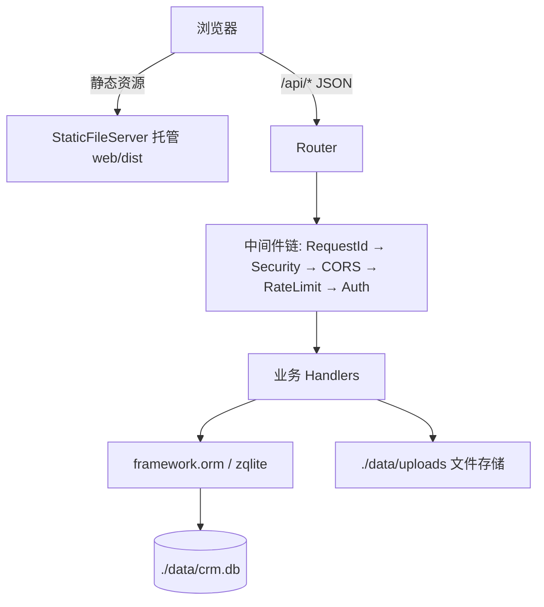

# 医学考试学习平台开发计划

> 版本：v1.2（2026-09-14）
> 状态：第 1 期已完成，待开发第 2 期
> v1.2 变更：第 1 期完成并验证（见 9 节备注）；项目目录名 `crm` 保持不变，仅作代号
> v1.1 变更：移除 CRM 相关内容（客户档案、跟进记录、待跟进），仅保留医学考试学习平台

---

## 1. 业务理解

做一个**医学考试学习平台**：

- **学员端**：医生/医学生等用户注册后，在平台上学习课程（视频/音频/文档）、查阅资料、刷题练习、参加模拟考试、记笔记、收藏。
- **管理后台**：运营/管理员管理用户、课程内容、题库、资料、公告、订单（手动标记支付）。
- **商业模式**：内容付费（课程/资料）。**第一期不接在线支付**，订单由管理员手动标记"已支付"（如通过线下/微信转账后人工确认）。
- **目标用户**：备考执业医师、中医助理医师等医学资格考试的人群（分类以考试学科组织，但采用通用分类树，不写死）。

### 关键决策记录（对话确认）

| 问题 | 决策 |
|---|---|
| CRM 模块 | **已取消**（v1.1）：不做客户档案/跟进记录，只做学习平台 |
| 在线支付 | 第一期不做，只手动记录支付状态 |
| 角色 | 学员 / 管理员 / 超管（不做讲师角色） |
| 注册方式 | 邮箱+用户名+密码自助注册，管理员可禁用账号 |
| 前端 | 单个 Vue 3 + Element Plus 项目，按角色分学员端/管理后台路由 |
| 架构 | 单进程单体（一个 Zig 二进制 + SQLite 单文件），后端托管前端静态文件 |
| 文件存储 | 本地磁盘 `./data/uploads` |
| Zig 版本 | 0.17.0-dev.2125+0d600e488（本地已装，与 build.zig.zon 一致） |
| 第一期范围外（放二期） | 打卡、学习报告、邀请码、优惠券、WebSocket 客服、在线支付、审计日志 |

---

## 2. 技术选型

| 层 | 选型 | 说明 |
|---|---|---|
| 后端语言 | Zig 0.17.0-dev.2125 | std.Io 新 API 时代 |
| HTTP 框架 | `http_framework`（自研，git 依赖） | 路由、中间件、JSON、session、内置 ORM、静态文件、multipart 上传 |
| 数据库 | SQLite（经 `zqlite`，框架 ORM 已封装） | 单文件 `./data/crm.db` |
| 密码哈希 | `std.crypto.pwhash.argon2id` | Zig 标准库自带 |
| 前端 | Vue 3 + Vite + Element Plus + Pinia + vue-router + axios | 单项目双端（学员/管理后台） |
| 部署 | Zig 二进制托管 API + 前端 dist 静态文件 | 开发期前端 vite dev server 代理 `/api` 到 Zig |

### http_framework 能力映射（已核对 README）

- 路由：`router.route(.GET, "/users/:id", handler)`，`ctx.param()` 取路径参数
- Handler 三模式：纯函数 / 单例 / 请求级（`initFactory`）
- JSON：`framework.parseJson(T, ...)`、`res.json(.{...})`
- 中间件：`RequestIdMiddleware`、`CompressMiddleware`、`SecurityHeaders`、`CorsMiddleware`、`RateLimiter`、`AuthMiddleware`、`ErrorRenderer`
- 会话：`framework.SessionManager`（cookie session）
- ORM：`framework.orm.Model(T, "table")` + `Query` 构造器 + `insert/findById/updateById/deleteById/findAll/count/paginate`
- 上传：`http_multipart` 模块
- 静态：`framework.StaticFileServer`

---

## 3. 系统架构



### 后端目录结构（规划）

```
src/
  main.zig          # juicy 入口：runZio → appMain
  root.zig          # 模块导出
  app/              # 应用装配
    app.zig         # 装配：Config → Db → 迁移/种子 → Services 注册 → 中间件 → 路由 → Server
    state.zig       # State：装配产物的所有权容器（无全局变量，见下约定）
    router.zig      # 路由注册
  db/
    db.zig          # zqlite 封装（Db wrapper）
    migrate.zig     # 建表（PRAGMA user_version）+ 种子数据
  web/
    respond.zig     # 统一 JSON 响应包装
    handlers/       # 按模块划分 handler（auth、courses、questions… 逐期接入）
      health.zig
    dist/           # 前端构建产物（静态托管）
  svc/              # ↓ 以下目录随各期开发逐步创建
```

### 约定

- 统一响应包装：`{ "ok": true, "data": ... }` / `{ "ok": false, "error": { "code": "...", "message": "..." } }`
- 依赖注入：**禁用全局变量**。启动时 `Services.register(state.State, st)` + `seal()` + `server.setServices()`，handler 用 `ctx.service(state.State)` 取回依赖（未来的 SessionManager 等同样注册为服务）
- 认证：cookie session（框架 SessionManager）+ 角色标记存 session；`AuthMiddleware` 保护 `/api/admin/*` 与需要登录的接口
- 时间戳：统一存 Unix 秒（INTEGER）
- 软删除：内容类表用 `deleted` 标记位；用户禁用用 `status` 字段
- JSON 复合字段（选项、答案、规则）存 TEXT，应用层序列化

---

## 4. 角色与权限

| 角色 | 权限 |
|---|---|
| guest | 浏览课程/资料/公告列表与详情，注册、登录 |
| student | guest + 学习（已报名课程）、练习、考试、收藏、笔记、改自己资料 |
| admin | student + 管理后台全部内容管理、订单、公告发布 |
| superadmin | admin + 用户角色管理、启用/禁用管理员、系统设置 |

---

## 5. 功能需求清单

### M-A 认证与用户
- A1 注册（邮箱唯一、用户名唯一、argon2id 哈希）
- A2 登录/登出（限流防暴力破解，失败次数限制由 RateLimiter + session 计数）
- A3 当前用户信息 `/api/auth/me`
- A4 修改密码、修改基本资料（昵称/头像）
- A5 管理员：用户列表（搜索/筛选/分页）、禁用/启用、改角色（仅超管）

### M-B 分类与内容
- B1 多级分类树（CRUD、排序、树查询），预置：执业医师/中医助理… 等一级分类（种子数据，可改）
- B2 课程 CRUD（标题、封面、简介、价格、免费标记、分类、状态草稿/上架、排序）
- B3 章节 CRUD（课程下三级：课程→章→课时）
- B4 课时：类型 = 视频/音频/文档(PDF)/Markdown/图文；关联资料库文件；免费试看标记
- B5 资料库：上传（multipart，本地 `./data/uploads/<yyyy-mm>/`）、下载（鉴权：付费资料需已报名）、按分类筛选、大小/类型校验

### M-C 学习
- C1 报名课程（免费课直接报名；付费课生成待支付订单，管理员标记后生效）
- C2 学习进度：课时完成状态、视频播放位置、Markdown/文档已读标记
- C3 学习时长上报（心跳/离开时），存 `study_logs`
- C4 我的课程列表 + 继续学习入口

### M-D 题库与练习
- D1 题目 CRUD：单选/多选/判断；题干、选项(JSON)、答案、解析、难度、分类；管理员批量导入（JSON/CSV）
- D2 章节练习：按分类/课程抽题，逐题作答即时判分
- D3 随机练习：按分类随机 N 题
- D4 答题记录 `practice_records`；错题自动进错题本，答对可从错题本移除（标记已掌握）
- D5 题目收藏
- （二期）填空题、简答题人工批改

### M-E 模拟考试
- E1 试卷管理：管理员配置（分类、时长、总分、及格分、各分类/题型抽题规则）
- E2 考试流程：开始考试（生成一次性题序，服务端计时）→ 交卷（服务端判分，多选半对规则：少选且无错选得 0.5 倍，错选 0 分——第一期简化为全对才得分）→ 成绩单 + 逐题解析回顾
- E3 考试记录列表、历史成绩

### M-F 订单（内容付费）
- F1 订单：学员下单/管理员代下单，金额、状态（待支付/已支付/已取消）、支付方式备注、操作人、备注
- F2 管理员标记支付/取消，联动报名状态
- （二期）业绩统计、导出

### M-G 平台功能（第一期）
- G1 公告：管理员发布/下架，学员端首页列表+详情
- G2 收藏：课程、资料（题目收藏并入题库模块）
- G3 笔记：按课程/课时记笔记，仅本人可见

### M-H 管理后台统计（基础版）
- H1 后台首页：用户数、课程数、题目数、待支付订单数、今日/7 日新增用户

### 第二期候选（本期不做，仅预留）
打卡、学习报告、邀请码、优惠券、WebSocket 客服、在线支付、填空题/简答题、审计日志、ElasticSearch 类搜索。

---

## 6. 数据库设计（SQLite）

> 全部表含 `created_at INTEGER`；标注者含 `updated_at INTEGER`、`deleted INTEGER DEFAULT 0`。

```sql
-- 用户
users(id INTEGER PK, email TEXT UNIQUE, username TEXT UNIQUE, password_hash TEXT,
      nickname TEXT, avatar TEXT, role TEXT DEFAULT 'student',      -- student/admin/superadmin
      status TEXT DEFAULT 'active',                                  -- active/disabled
      created_at, updated_at)

-- 分类树
categories(id PK, parent_id INTEGER DEFAULT 0, name TEXT, sort INTEGER DEFAULT 0, deleted)

-- 课程
courses(id PK, category_id, title, cover, summary, description TEXT,
        price INTEGER DEFAULT 0,          -- 分
        is_free INTEGER DEFAULT 0, status TEXT DEFAULT 'draft',      -- draft/published
        sort, enroll_count INTEGER DEFAULT 0, deleted, created_at, updated_at)

chapters(id PK, course_id, title, sort, deleted)

lessons(id PK, course_id, chapter_id, title,
        content_type TEXT,                 -- video/audio/pdf/markdown/rich
        resource_id INTEGER DEFAULT 0,     -- 关联资料库
        content TEXT,                      -- markdown/富文本直接存储
        duration INTEGER DEFAULT 0,        -- 秒
        is_free INTEGER DEFAULT 0, sort, deleted)

-- 资料库
resources(id PK, category_id, name, orig_name, type,        -- video/audio/pdf/doc/image/markdown
          file_path, size INTEGER, mime, uploader_id, is_public INTEGER DEFAULT 1,
          deleted, created_at)

-- 报名与订单
enrollments(id PK, user_id, course_id, source TEXT DEFAULT 'self',  -- self/admin
            pay_status TEXT DEFAULT 'unpaid',                        -- unpaid/paid/free
            created_at, UNIQUE(user_id, course_id))

orders(id PK, order_no TEXT UNIQUE, user_id, course_id, amount INTEGER,
       status TEXT DEFAULT 'pending',                                -- pending/paid/cancelled
       pay_method TEXT, remark TEXT, operator_id INTEGER DEFAULT 0,
       paid_at INTEGER, created_at)

-- 学习
learning_progress(id PK, user_id, lesson_id, course_id,
                  status TEXT DEFAULT 'not_started',    -- not_started/in_progress/completed
                  position INTEGER DEFAULT 0,           -- 视频秒
                  updated_at, UNIQUE(user_id, lesson_id))

study_logs(id PK, user_id, course_id, lesson_id, seconds INTEGER, date TEXT, created_at) -- date: 'YYYY-MM-DD'

-- 题库
questions(id PK, category_id, course_id INTEGER DEFAULT 0,
          type TEXT,                       -- single/multi/judge
          stem TEXT, options TEXT,         -- options JSON: ["...", "..."]
          answer TEXT,                     -- "A" / "ABD" / "T"/"F"
          explanation TEXT, difficulty INTEGER DEFAULT 2,
          used_count INTEGER DEFAULT 0, creator_id, deleted, created_at)

practice_records(id PK, user_id, question_id, is_correct INTEGER,
                 duration INTEGER, source TEXT,   -- chapter/random/exam
                 session_id INTEGER DEFAULT 0, created_at)

wrong_questions(id PK, user_id, question_id, wrong_count INTEGER DEFAULT 1,
                mastered INTEGER DEFAULT 0, last_wrong_at, UNIQUE(user_id, question_id))

question_favorites(id PK, user_id, question_id, created_at, UNIQUE(user_id, question_id))

-- 模拟考试
exams(id PK, category_id, title, duration_min INTEGER, total_score INTEGER,
      pass_score INTEGER, rules TEXT,      -- 抽题规则 JSON: [{type, category_id, count, score_each}]
      status TEXT DEFAULT 'draft', deleted, created_at)

exam_attempts(id PK, exam_id, user_id, questions TEXT,   -- 试卷题序快照 JSON
              answers TEXT,                 -- 作答 JSON（服务端判分后）
              score INTEGER DEFAULT -1, passed INTEGER,
              started_at, deadline_at, submitted_at INTEGER DEFAULT 0)

-- 平台
favorites(id PK, user_id, target_type TEXT, target_id INTEGER, created_at,
          UNIQUE(user_id, target_type, target_id))       -- target_type: course/resource

notes(id PK, user_id, course_id INTEGER DEFAULT 0, lesson_id INTEGER DEFAULT 0,
      content TEXT, updated_at, deleted, created_at)

announcements(id PK, title, content TEXT, status TEXT DEFAULT 'draft',
              author_id, published_at INTEGER DEFAULT 0, deleted, created_at)
```

索引：各外键列、`practice_records(user_id, question_id)`、`study_logs(user_id, date)`、`orders(status)`。

---

## 7. API 设计（REST，前缀 `/api`）

### 公开
| Method | Path | 说明 |
|---|---|---|
| POST | /auth/register | 注册 |
| POST | /auth/login | 登录 |
| POST | /auth/logout | 登出 |
| GET | /auth/me | 当前用户（含角色） |
| GET | /categories | 分类树 |
| GET | /courses | 课程分页列表（?category_id=&keyword=&page=&size=） |
| GET | /courses/:id | 课程详情+章节课时树（未付费用户锁定非免费课时内容） |
| GET | /resources | 资料分页列表（?category_id=&type=） |
| GET | /announcements | 已发布公告 |
| GET | /announcements/:id | 公告详情 |

### 学员（需登录）
| Method | Path | 说明 |
|---|---|---|
| PUT | /user/profile | 改昵称/头像 |
| PUT | /user/password | 改密码 |
| POST | /courses/:id/enroll | 报名（免费→直接 paid；付费→建订单） |
| GET | /me/enrollments | 我的课程 |
| GET | /me/progress?course_id= | 我的进度 |
| POST | /learning/progress | 上报进度 {lesson_id,status,position} |
| POST | /learning/heartbeat | 时长心跳 {lesson_id,seconds} |
| POST | /practice/start | 开始练习 {mode:chapter/random, category_id, count} → 题目（不含答案） |
| POST | /practice/submit | 逐题提交 {question_id,answer,duration} → 判分结果 |
| GET | /practice/wrong | 错题本（分页，?mastered=0） |
| POST | /practice/wrong/:id/master | 标记已掌握 |
| GET | /exams | 可考试试卷列表 |
| POST | /exams/:id/start | 开考 → 题目快照+截止时间 |
| POST | /exam-attempts/:id/submit | 交卷答卷 {answers} → 成绩 |
| GET | /exam-attempts | 考试记录 |
| GET | /exam-attempts/:id | 成绩回顾（逐题+解析） |
| POST/DELETE | /favorites | 收藏/取消 {target_type,target_id} |
| GET | /favorites | 我的收藏 |
| POST/PUT/DELETE | /notes | 笔记 CRUD |
| POST | /questions/:id/favorite | 题目收藏切换 |
| GET | /practice/favorites | 题目收藏列表（分页，含答案与解析，复盘用） |
| GET | /resources/:id/download | 鉴权下载（流式） |

### 管理后台（/api/admin/*，role ≥ admin）
| Method | Path | 说明 |
|---|---|---|
| GET/PUT | /admin/users, /admin/users/:id, /admin/users/:id/status | 用户管理、禁用启用 |
| PUT | /admin/users/:id/role | 改角色（仅超管） |
| POST/PUT/DELETE | /admin/categories | 分类 |
| POST/PUT/DELETE | /admin/courses, chapters, lessons | 内容管理 |
| POST | /admin/upload | multipart 上传 → resource |
| POST/PUT/DELETE | /admin/resources | 资料管理 |
| POST/PUT/DELETE | /admin/questions | 题目管理；POST /admin/questions/import 批量导入 |
| POST/PUT/DELETE | /admin/exams | 试卷管理 |
| GET | /admin/orders | 订单列表（?status=） |
| POST | /admin/orders/:id/pay | 标记已支付（同步 enrollment.pay_status） |
| POST/PUT/DELETE | /admin/announcements | 公告；POST /:id/publish 发布 |
| GET | /admin/stats | 后台首页统计 |

---

## 8. 前端页面清单（Vue 3 单项目）

技术：Vue 3 `<script setup>` + Vite + Element Plus + Pinia + vue-router + axios；开发代理 `/api → http://localhost:8080`；生产 `zig build` 后由 StaticFileServer 托管 `web/dist`。

```
web/
  src/
    api/          # axios 封装 + 各模块 api
    stores/       # auth store（user/role）、ui store
    router/       # 路由守卫：requiresAuth / requiresAdmin
    layouts/      # StudentLayout / AdminLayout
    views/
      student/    Login, Register, Home(课程/资料/公告), CourseList, CourseDetail,
                  LessonLearn(视频/文档/markdown 播放器), ResourceList,
                  Practice(章节练习/随机练习), WrongBook, ExamList, ExamTaking(计时答题),
                  ExamResult, MyCourses, MyNotes, MyFavorites, Profile, Announcements
      admin/      Dashboard, UserList, CategoryManage, CourseManage(含章节编辑),
                  LessonEdit, ResourceManage(上传), QuestionManage(批量导入),
                  ExamManage, OrderList, AnnouncementManage
```

关键点：
- 路由守卫按 `role` 区分学员端/后台
- 答题页考试模式不展示答案，练习模式即时反馈
- 考试页本地倒计时 + 到点自动交卷，以服务端 deadline 为准
- 视频播放：HTML5 `<video>`，位置恢复用 `progress.position`

---

## 9. 开发阶段任务

### 第 0 期：基础设施（先行）
- [x] T0.1 目录结构搭建（src/app、handlers、db 等），清理模板代码
- [x] T0.2 配置加载（端口、数据目录、session secret）
- [x] T0.3 数据库打开 + `migrate.zig` 建表 + 幂等迁移方案（PRAGMA user_version 版本号递增）
- [x] T0.4 统一 JSON 响应/错误处理（AppError → 响应包装），接入框架中间件与 logger
- [x] T0.5 种子数据：超管账号、示例分类
- [x] T0.6 健康检查 `/api/health` + 前端静态托管；跑通 `zig build run`
- [x] T0.7 验证 zqlite 多请求并发访问（单进程内加锁），发现问题记录 bug 文档

**第 0 期完成备注（2026-09-13 验证记录）**：

- `zig build test` 3/3 通过；`zig build run` 冒烟通过：
  - `GET /api/health` → `{"ok":true,"data":{"status":"ok",...,"schema_version":1}}`
  - 未注册路由 → JSON 404 envelope；`/` → 静态占位页
- T0.7 并发验证：50 个并发 curl 全部 200，无 SQLITE busy、无崩溃。结论：zio 单线程协程调度 + sqlite 调用间不让出 → 单 `Conn` 不加锁可行，继续观察（后续写接口上线后重测）。
- 框架 ORM（`framework.orm`）实为 **JSON 文件存储**，非 SQLite → 本项目直接使用 `zqlite` 裸 SQL，封装在 `src/db/`。
- 配置策略（v1.2 调整）：**不自建 Config struct**，直接使用 `framework.Config`（network/http/body/pool 分层）；应用级路径（data_dir/db_path/static_dir）暂时硬编码在 `app.zig` 常量。框架缺口（无应用级扩展槽、无 env/文件加载入口）已起草 issue → `http-framework-issues.md`（待提交，gh CLI 未安装）。
- 退出清理约定：`Router.deinit()` 会通过中间件 destroy 钩子**自动调用**带 `deinit` 的中间件实例（如 `RateLimiter.deinit`）。因此：
  1. 不要对已注册进 router 的中间件实例再手动 `deinit`（会 double-free，实测触发 `incorrect alignment` panic）；
  2. `st`（State，持有中间件实例）必须在 `rt.deinit()` **之后**销毁，不能用 `defer` 抢在前面。
  已在 `app.zig` 中按 `server.deinit → rt.deinit → st → db close` 顺序收尾，并为错误路径配了对称 `errdefer` 链；正常退出与 AddressInUse 错误退出均验证 0 泄漏。
  该 double-deinit 陷阱也已在 `http-framework-issues.md` Issue 2 中建议框架改善文档。
- 环境提醒：`zig-pkg/` 是包缓存目录，不要手工编辑；损坏时删除该目录后 `zig build --fetch` 可恢复。

### 第 1 期：认证与用户（M-A）
- [x] T1.1 注册/登录/登出/me（argon2id + session）
- [x] T1.2 登录限流、禁用账号拦截
- [x] T1.3 资料/密码修改；管理员用户管理接口

**第 1 期完成备注（2026-09-14 验证记录）**：

- `zig build test` 全绿（auth 哈希/LoginGuard/镜像 各 repo 单测）。
- `scripts/smoke_phase1.sh` 40/40 通过，覆盖：注册（含重复 409、坏 JSON 400）、登录/登出/me（含无 cookie 401、学员打 /admin 403）、改资料、改密+会话轮换、禁用拦截（403）、登录限流（5 次 401 后 429）、角色变更（自改 400）、泄漏/AddressInUse 检查。
- 修复：冒烟脚本 admin 登录的占位密码 `***` → 种子默认密码 `admin123456`（此前该步骤一直假失败）。
- 安全约定落地：登录成功/改密后调用 `session.rotate` 防会话固定；禁用账号由 /me 自查 + 中间件不查库，详见 `auth_middleware.zig` 注释。
- 待办：`http-framework-issues.md` 建议已起草，仓库尚无 commit（git 未初始化提交），后续补齐。

### 第 2 期：内容与资料（M-B）

- [x] T2.1 分类树 CRUD（种子 7 个一级分类全为根节点 sibling，管理端支持传参生成任意父子树）+ 公开树查询
- [x] T2.2 课程/章节/课时 CRUD + 管理端列表/详情 + 公开端「只显示 published、草稿 404」
- [x] T2.3 资料库：multipart 上传落盘（`./data/uploads/<yyyy-mm>/`）、鉴权下载（私密需已登录+管理端 or 已报名[p3 定]; 游客 401）、管理员元数据维护

**第 2 期完成备注（2026-09-14 验证记录；沿用第 1 期「干净机器 + 全新 DB」纪律后全绿）**：

- 分类/课程/章节/课时/资料全部走真实 HTTP 冒烟：`scripts/smoke_phase2.sh` **PASS=41 FAIL=0**，同二进制 `zig build test` 8/8、期一 40/40。
- 经验（期二踩的 3 个 ALL 是**冒烟脚本自身缺陷**而非框架/路由，已修）：
  1. 冒烟里对 `categories` 树取 id 用的是「对象」的 `['data']['id']`，但 `/api/categories` 返回**数组** → 空 id → `PUT/DELETE /api/admin/categories/`（集合）→ 405「Method Not Allowed」。改为 `['data'][0]['id']`。
  2. 冒烟 DELETE 了**种子根（id=1）**（期二初误写「有子分类 409」前提，种子 7 个全为根），之后所有依赖 `category_id=1` 的 create 全部「分类不存在」。改用**临时分类**做 update/delete 验证，种子根保持不动。
  3. 查询参数 `?keyword=课程 B` 直接塞中文，未 URL 编码 → 服务器收到空 keyword，匹配全表首条（误判「草稿泄漏」）。改成 `%E8%AF%BE%E7%A8%8B%20B`。
- 结论：**三个「分类不存在」FAIL 均非产品代码 bug**；框架 multipart/下载/405 语义均按规约工作。期二验证同时确认了「种子纯兄弟根」这一已知约束（分类树层级由管理端 POST 展开，属产品预期，非缺陷）。


### 第 3 期：学习（M-C）
- [x] T3.1 报名（免费直通/付费建订单）
- [x] T3.2 进度上报/查询、心跳时长
- [x] T3.3 我的课程、继续学习数据

**第 3 期完成备注（2026-09-15 验证记录，Windows）**：

- `zig build test` 11/11 全绿（learning_repo 报名/解锁/upsert/聚合/utcDate 单测）；`scripts/smoke_phase3.sh` **PASS=66 FAIL=0**，覆盖：报名 404（不存在/草稿）、付费 pending_payment+order_no、幂等 already_enrolled、未支付不解锁 403、免费课直通、试看课时未报名可学、进度 upsert 同行、position 负值钳 0、status 白名单 400、坏 JSON/缺参 400、心跳 seconds 1-600 边界 400、UTC 日期、我的课程聚合（completed/last_lesson/last_position/排序）、me/progress、游客 401。
- 设计：`order_no = O{now}-{enroll_id}`（确定性，UNIQUE 兜底）；报名+建订单包 `BEGIN IMMEDIATE` 事务；解锁规则 = `pay_status IN ('paid','free')`，支付标记留给第 6 期；`learning_progress` UPSERT 靠 `UNIQUE(user_id,lesson_id)`；`study_logs` 按 UTC 日期聚合（为第 7 期统计预留）。
- 踩坑 1（**Zig 0.17.0-dev std.fmt 怪癖**，非框架问题）：有符号整数带宽度格式会给正数加 '+'（`{d:0>4}` 对 i64 1970 → "+1970"，见 `Io/Writer.zig printIntAny`）→ `utcDate` 转 u64 后零填充；`storage.monthDir` 因 `epoch.Year=u16` 不受影响。
- 踩坑 2（Windows 环境）：git-bash 下 curl argv 里的中文被系统码页破坏 → 服务端收到非法 UTF-8 → JSON 400。第 3 期脚本请求体全 ASCII；后续脚本在 Windows 上验证时遵循同一约定。
- 踩坑 3（Windows 环境）：无 POSIX 信号，`kill` = TerminateProcess（rc=143），无法验证 SIGTERM 优雅关停 → 脚本按平台分支断言；Linux/macOS 上仍验 exit 0 + 泄漏检查。

### 第 4 期：题库与练习（M-D）
- [x] T4.1 题目 CRUD + 批量导入
- [x] T4.2 章节/随机练习、判分、答题记录
- [x] T4.3 错题本 + 掌握标记 + 题目收藏

**第 4 期完成备注（2026-09-15 验证记录，Windows）**：

- `zig build test` 18/18 全绿（新增 question_repo CRUD/校验/抽题/CSV 解析与 practice_repo 错题/收藏集成测试）；`scripts/smoke_phase4.sh` **PASS=98 FAIL=0**（连跑两遍幂等），覆盖：建题四类校验失败（题型/分类/多选单字母/答案越界）、judge 选项忽略与 TRUE→T 规范化、更新答案、列表过滤（分类/keyword/type）、JSON 导入（全有成败：坏批含「第N行」文案且总数不变）、CSV 导入（引号字段含逗号/列数不正 400）、questions+csv 二选一 400、游客 401、坏 mode/空池 400、count 钳制、抽题视图不含答案/解析（python 断言）、used_count 递增、判分全分支（判分宽松：乱序重复小写；judge 接受 true；空答/无字母/坏 source/坏 duration → 400）、错题本 count 累加 + 答对自动 mastered、wrong_count 保留、mastered=0/1/-1 列表、手动掌握（幂等）+404、收藏切换/列表/404、软删联动（get/submit/收藏 404，错题列表隐藏）。
- 设计：答案入库即规范化（judge "T"/"F"、单选 1 字母、多选升序去重 "ABD"），options 以 JSON 字符串数组存列；练习**无状态**（start 抽题 + submit 逐题即时判分，不落会话），`practice_records.session_id=0` 预留给第 5 期考试（= exam_attempts.id）；错题本 UPSERT 在 `BEGIN IMMEDIATE` 事务内与答题记录同写，答对只置 mastered=1 不清零 wrong_count（复盘价值）；抽题/错题/收藏查询一律 `JOIN questions ... deleted=0`，软删题自动隐身。导入语义「先全量校验、全对才入库」，避免部分导入后前端难对账。
- 新增路由（§7 未列，属功能闭环必要补充）：`GET /api/practice/favorites`（D5 题收藏需读端点；§7 的 `GET /favorites` 是第 7 期 G2 课程/资料通用收藏，路径不冲突）。
- 踩坑 4（**Zig 0.17.0-dev 语言变更**，非框架问题）：`**` 数组重复运算符已移除 → `@splat(false)` 配合目标类型推导长度；`catch |e| {} else |v| {}` 已移除 → 用 `if (expr) |v| {} else |e| {}`；`std.ArrayList(T).init(alloc)` 移除 → `.empty` + `append(a, ..)`；switch 的 prong **不再收窄** catch 捕获的错误集 → `validationMsg` 改收 `anyerror` + else 兜底；`std.ascii.upperString` 不再返回 error union，且定长栈缓冲遇超长输入 debug assert → 改 `std.ascii.eqlIgnoreCase` 逐字比较（同时堆除了一类潜在 panic：学员对判断题送超长字符串可炸进程）。
- 踩坑 5（冒烟脚本）：AppError 错误体是**纯文本**（框架 ErrorRenderer `res.text`，见 issues 草稿 Issue 4）→ 断言错误文案用 `grep` 而非 json.load；bash 单引号串里的 `\"` 不会被剥除（是字面量），JSON 结构引号用裸 `"`、仅字段值内引号用 `\"`。

### 第 5 期：模拟考试（M-E）
- [ ] T5.1 试卷管理 + 抽题规则
- [ ] T5.2 开考/交卷/服务端计时判分/成绩回顾

### 第 6 期：订单（M-F）
- [ ] T6.1 订单创建/列表/取消
- [ ] T6.2 标记支付联动报名状态

### 第 7 期：平台功能（M-G/H）
- [ ] T7.1 公告；T7.2 收藏/笔记；T7.3 后台统计接口

### 第 8 期：前端学员端
- [ ] T8.1 项目脚手架 + 布局 + 路由守卫 + axios 封装
- [ ] T8.2 认证页 + 首页 + 课程列表/详情/学习页
- [ ] T8.3 资料库、练习、错题本、考试、个人中心

### 第 9 期：前端管理后台
- [ ] T9.1 Dashboard、用户、分类、课程/课时编辑
- [ ] T9.2 资料上传、题库/试卷管理、订单、公告

### 第 10 期：打磨与部署
- [ ] T10.1 端到端冒烟（脚本或手动清单）、性能与限流调优
- [ ] T10.2 打包脚本：`zig build -Doptimize=ReleaseSafe` + 前端 build + 部署说明 README
- [ ] T10.3 备份策略：SQLite 定时复制（简单 cron 脚本）

> 每期完成后运行 `zig build test`；后端接口用 `zig build test` 内的集成测试或 curl 冒烟覆盖。

---

## 10. http_framework bug 记录机制

- 发现框架 bug 时立即记录到 `http-framework-bug.md`，编号 `BUG-001` 递增。
- 模板字段：**日期 / 模块（router、orm、session、multipart…）/ 症状 / 最小复现代码 / 疑似位置 / 对本项目的影响 / 当前 workaround / 状态（open/fixed）**。
- 严重 bug（崩溃、数据损坏、安全）先在业务侧加 workaround 保证进度，再继续开发。
- 修复框架后回到该文档更新状态，必要时同步 bump `build.zig.zon` 依赖 hash。

---

## 11. 风险与待办确认

| 风险 | 应对 |
|---|---|
| zqlite/ORM 在并发请求下的线程安全未验证 | ✅ T0.7 已验证（50 并发全 200，单 Conn 无锁可行）；写接口上线后重测 |
| 框架 ORM 能力不足（多表 JOIN、聚合统计） | 回退手写 SQL（zqlite 原生 prepare/exec），封装在 `db/` 层 |
| 大文件上传内存占用 | 确认 multipart 是否流式写盘；不支持则限制上传大小（先限 200MB）并记录 bug |
| Zig 0.17-dev API 仍在变动 | 升级前全量 `zig build test`；技能库以 0.16 为基准，细节以本地工具链报错为准 |
| 视频托管带宽 | 第一期本地磁盘即可，文档预留 resource.file_path 可改对象存储 |
